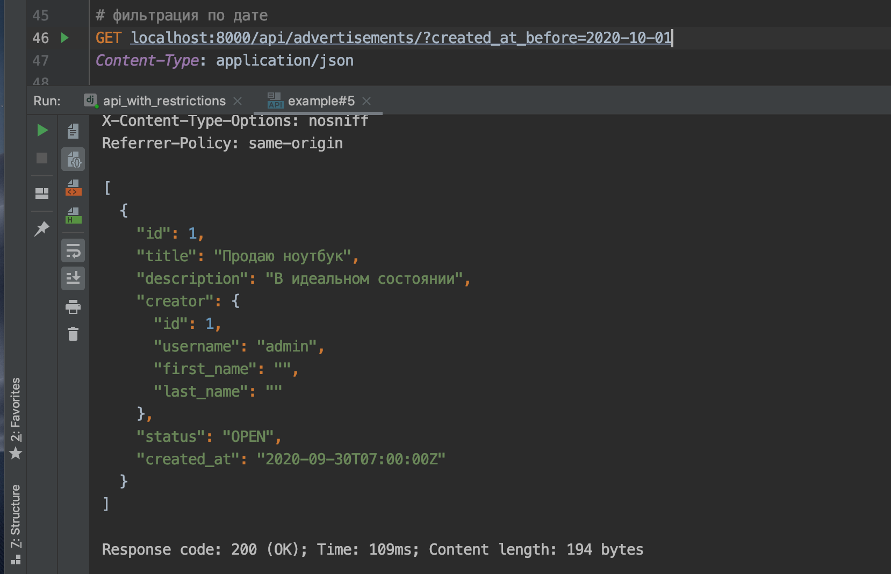
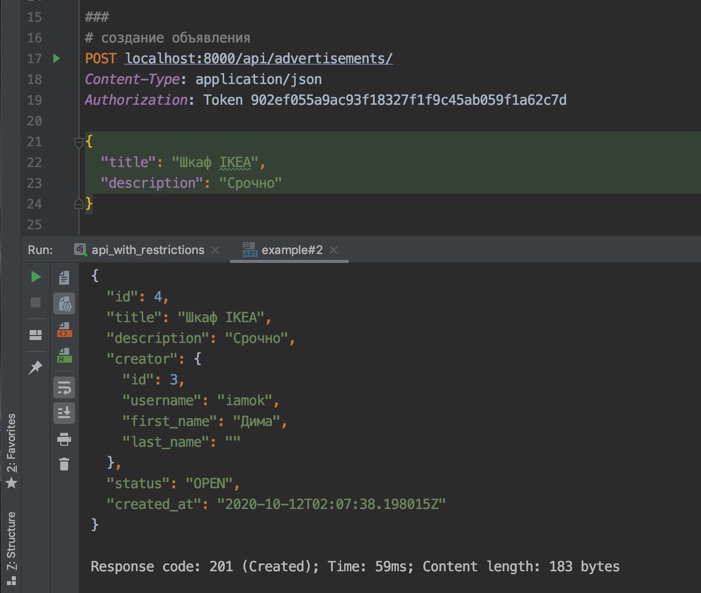
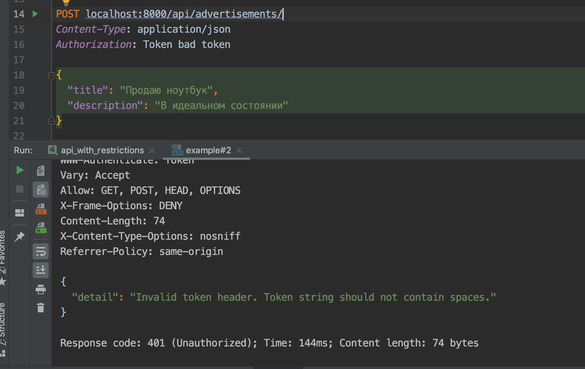

# Backend для приложения с объявлениями

## Описание

Необходимо реализовать бэкенд для мобильного приложения с объявлениями. Объявления можно создавать и просматривать. Есть возможность фильтровать объявления по дате и статусу.

Создавать могут только авторизованные пользователи. Для просмотра объявлений авторизация не нужна.

У объявления есть статусы: `OPEN`, `CLOSED`. Необходимо валидировать, что у пользователя не больше 10 открытых объявлений.

Обновлять и удалять объявление может только его автор.

Чтобы боты и злоумышленники не нагружали нашу систему, добавьте лимиты на запросы:

- для неавторизованных пользователей: 10 запросов в минуту;
- для авторизованных пользователей: 20 запросов в минуту.

## Реализация

- Используйте `DateFromToRangeFilter` для фильтрации по дате https://django-filter.readthedocs.io/en/stable/ref/filters.html#datefromtorangefilter.

Пример работы:


- В настройках подключено приложение `rest_framework.authtoken` и сконфигурирован `DEFAULT_AUTHENTICATION_CLASSES`. Для того, чтобы завести токен для пользователя, проделайте следующие шаги:

  - создайте пользователя через админку,
  - также через админку заведите ему токен,
  - этот токен используйте в запросах, передавая его в заголовках.

- Так как интерфейс BrowserableAPI в DRF не позволяет передавать заголовки с токеном, используйте Postman или HTTP-клиент VSCode.

Примеры:

Успешный запрос:


Неправильный токен:


- Для переопределения доступов для отдельных методов `ViewSet` используется метод `get_permissions`. Он добавлен в заготовку, следует с ним ознакомиться и посмотреть с помощью breakpoint'ов в какой момент DRF его вызывает.

- Валидацию удаления чужого объявления следует делать:

  - либо внутри метода `destroy` https://www.django-rest-framework.org/api-guide/viewsets/#viewset-actions — это чуть проще;
  - либо определяя дополнительный класс-наследник `BasePermission`, дополнительно добавляя его в список `get_permissions` https://www.django-rest-framework.org/api-guide/permissions/#examples — это правильнее, и этот класс можно переиспользовать для других методов.

    Любой вариант допустим в рамках этого задания.

- С примерами запросов к API вы можете ознакомиться в [файле requests-examples.http](./requests-examples.http).

# Важно

Приложение называется `advertisements`, такие слова являются триггерами для блокировщиков рекламы (например, uBlock Origin). Рекомендуется отключить блокировщик, если вы им пользуетесь, либо переименовать приложение.

## Подсказки

1. В места, где нужно добавлять код, включены `TODO`-комментарии.

2. Ознакомьтесь целиком со структурой проекта. Разберите, как работает код в заготовке, например, проставляется поле создателя объявления таким образом, чтобы злоумышленник не мог создавать объявления от чужого лица.

3. Используйте возможность указывать `fields` в `Meta` внутри `FilterSet` класса, чтобы не задавать фильтры, которые могут сгенерироваться автоматически.

4. Админка Джанго по умолчанию даст возможность создания и редактирования пользователей и токенов. Этим удобно пользоваться для локального создания сущностей.

## Дополнительные задания (не обязательные к выполнению)

### Права для админов

- Реализуйте функциональность для админов. Админы могут менять и удалять любые объявления.

### Избранные объявления

- Добавить возможность добавлять объявления в избранное. Автор объявления не может добавить своё объявление в избранное. Должна быть возможность фильтрации по избранным объявлениям. Например, пользователь хочет посмотреть все объявления, которые он добавил в избранное.

- Для того, чтобы добавить дополнительный метод с урлом во ViewSet, вам может пригодиться декоратор `action` из `DRF`.

### Добавить статус `DRAFT`

- Добавьте статус `DRAFT` — черновик. Пока объявление в черновике, оно показывается только автору объявления, другим пользователям оно недоступно.

## Документация по проекту

Для запуска проекта необходимо

Установить зависимости:

```bash
pip install -r requirements.txt
```

Вам необходимо будет создать базу в postgres и прогнать миграции:

```base
manage.py migrate
```

Выполнить команду:

```bash
python manage.py runserver
```

### API Эндпоинты

#### Объявления

| Метод	| Эндпоинт	| Описание	| Права |
|-------|-----------|-----------|-------|
| GET	| `/api/advertisements/` |	Список объявлений	| Публичный |
| GET	| `/api/advertisements/{id}/`	| Детали объявления	| Публичный |
| POST |	`/api/advertisements/` |	Создание объявления	| Только авторизованные |
| PATCH |	`/api/advertisements/{id}/`	| Частичное обновление |	Автор/Админ |
| PUT |	`/api/advertisements/{id}/`	| Полное обновление	| Автор/Админ |
| DELETE |	`/api/advertisements/{id}/` |	Удаление |	Автор/Админ |

#### Избранное

| Метод	| Эндпоинт	| Описание	| Права |
|-------|-----------|-----------|-------|
| POST |	`/api/advertisements/{id}/favorite/` |	Добавить в избранное |	Авторизованные |
| DELETE |	`/api/advertisements/{id}/unfavorite/` |	Удалить из избранного |	Авторизованные |
| GET	| `/api/advertisements/favorites/` |	Список избранных	| Авторизованные |

### Фильтрация

#### Параметры фильтрации

| Параметр	| Тип	| Описание	| Пример |
|-----------|-----|-----------|--------|
| `status` |	string |	Фильтр по статусу	| `?status=OPEN` |
| `creator`	| integer	| Фильтр по создателю	| `?creator=1` |
| `title`	| string	| Поиск по заголовку	| `?title=ноутбук` |
| `created_at_before`	| date	| До даты	| `?created_at_before=2026-08-01` |
| `created_at_after`	| date	| После даты	| `?created_at_after=2026-07-01` |
| `is_favorited`	| boolean	| Только избранные |	`?is_favorited=true` |


#### Примеры фильтрации

```http
# Все открытые объявления
GET /api/advertisements/?status=OPEN

# Объявления пользователя с id=1
GET /api/advertisements/?creator=1

# Поиск по заголовку
GET /api/advertisements/?title=ноутбук

# Объявления за июль 2026
GET /api/advertisements/?created_at_after=2026-07-01&created_at_before=2026-08-01

# Только избранные объявления
GET /api/advertisements/?is_favorited=true
```

### Аутентификация

Используется Token Authentication.

#### Получение токена

1. Создайте пользователя через админку: `/admin/`
2. Создайте токен для пользователя: `/admin/authtoken/token/`
3. Используйте токен в запросах:
```http   
Authorization: Token ваш_токен
```

### Примеры запросов

#### Создание объявления
```http
POST /api/advertisements/
Authorization: Token ваш_токен
Content-Type: application/json

{
  "title": "MacBook Pro",
  "description": "Продам MacBook Pro в отличном состоянии",
  "status": "OPEN"
}
```

#### Обновление объявления
```http
PATCH /api/advertisements/1/
Authorization: Token ваш_токен
Content-Type: application/json

{
  "status": "CLOSED"
}
```

#### Добавление в избранное
```http
POST /api/advertisements/1/favorite/
Authorization: Token ваш_токен
```

#### Получение избранных
```http
GET /api/advertisements/favorites/
Authorization: Token ваш_токен
```

### Ответы API

#### Успешный ответ (200 OK)
```json
{
  "id": 1,
  "title": "MacBook Pro",
  "description": "Продам MacBook Pro в отличном состоянии",
  "creator": {
    "id": 1,
    "username": "john",
    "first_name": "John",
    "last_name": "Doe"
  },
  "status": "OPEN",
  "created_at": "2026-07-15T10:30:00Z",
  "updated_at": "2026-07-15T10:30:00Z",
  "is_favorited": false,
  "favorites_count": 5
}
```

#### Ошибка валидации (400 Bad Request)
```json
{
  "detail": "Нельзя создавать более 10 открытых объявлений."
}
```

#### Ошибка авторизации (401 Unauthorized)
```json
{
  "detail": "Authentication credentials were not provided."
}
```

#### Отказ в доступе (403 Forbidden)
```json
{
  "detail": "You do not have permission to perform this action."
}
```

### Ограничения

#### Лимит открытых объявлений
* Пользователь не может иметь более 10 объявлений со статусом OPEN
* Попытка создать 11-е открытое объявление вернет ошибку
* Попытка перевести закрытое объявление в OPEN, если уже есть 10 открытых, также вернет ошибку

#### Ограничения для черновиков (DRAFT)
* Черновики видны только автору объявления
* Администраторы видят все черновики
* Неавторизованные пользователи не видят черновики
* Черновики нельзя добавить в избранное

#### Ограничения для избранного
* Пользователь не может добавить свое объявление в избранное
* Одно объявление можно добавить в избранное только один раз
* Черновики нельзя добавить в избранное